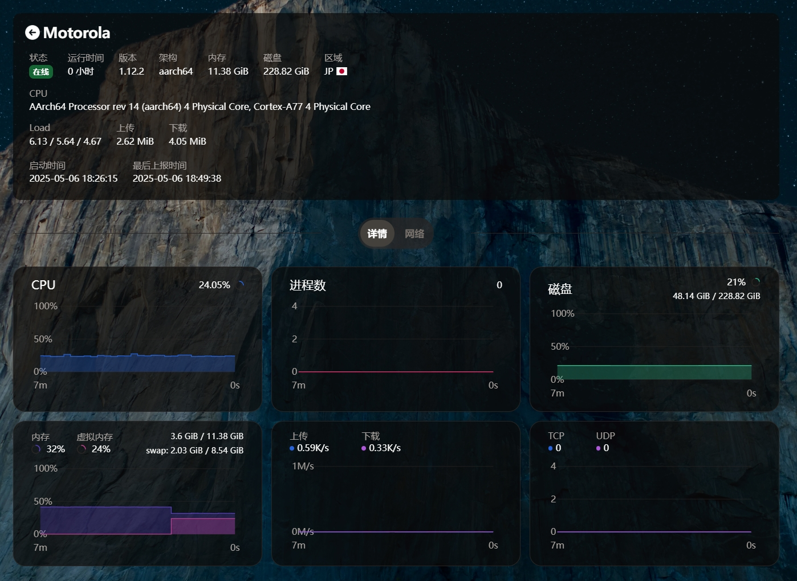

## 哪吒 Magisk模块
> 温馨提示：此模块面向ChatGPT生成

**下载`module.zip`，修改模块中 `/bin/config.yml` 的配置文件，再用 Magisk 刷入即可**

- `insecure_tls: true` 这个变量可以尝试改成 `false`
- 本人手机 `true` 才能上线，不知为何，由于没有备用机测试，想尝试的可以改回 `false`

## 探针效果展示

  <!-- 请确保图片在仓库的根目录下 -->
